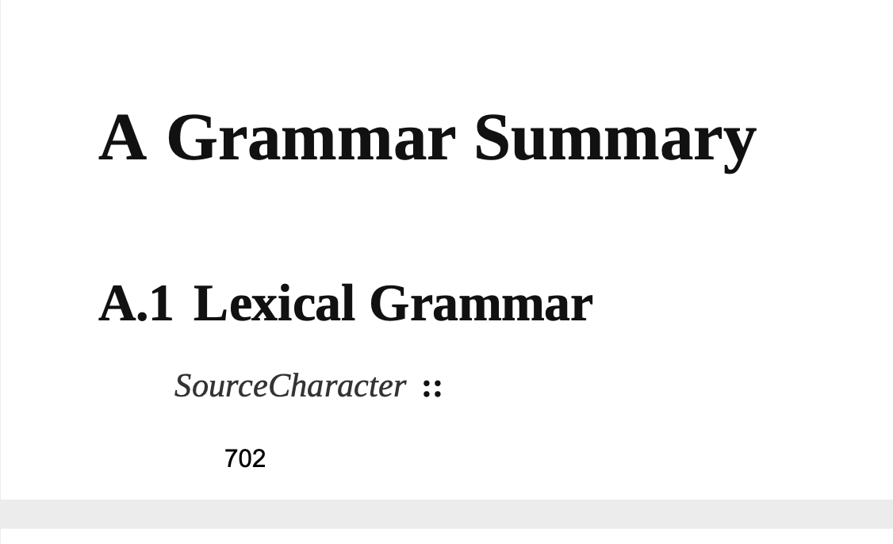
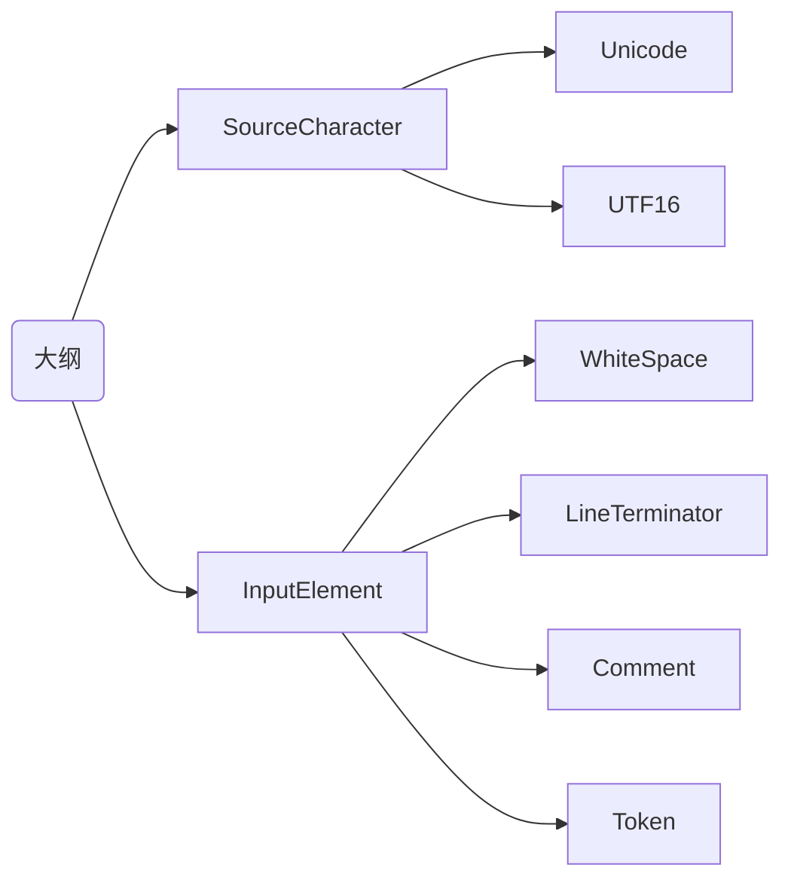
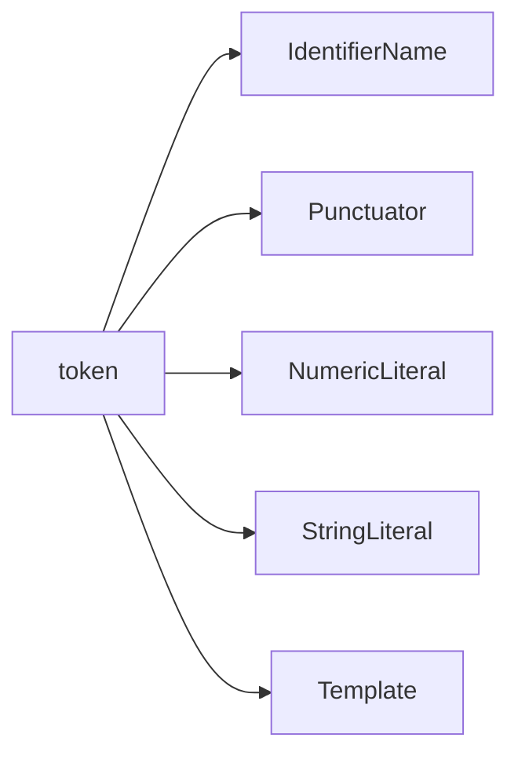

# 解读大纲

[ECMAScript 标准文档下载](https://www.ecma-international.org/technical-committees/tc39/?tab=published-standards)

本文解读的是 ECMA-262 标准文档，以附录 A（Grammar Summary）为起点，逐个学习 ECMA 的规范。

```mermaid
graph LR
  dg(大纲) --> SourceCharacter
  SourceCharacter --> Unicode
  SourceCharacter --> UTF16
  dg --> InputElement
  InputElement --> WhiteSpace
  InputElement --> LineTerminator
  InputElement --> Comment
  InputElement --> Token
```

Token 导图：

```mermaid
graph LR
  token --> IdentifierName
  token --> Punctuator
  token --> NumericLiteral
  token --> StringLiteral
  token --> Template
```
