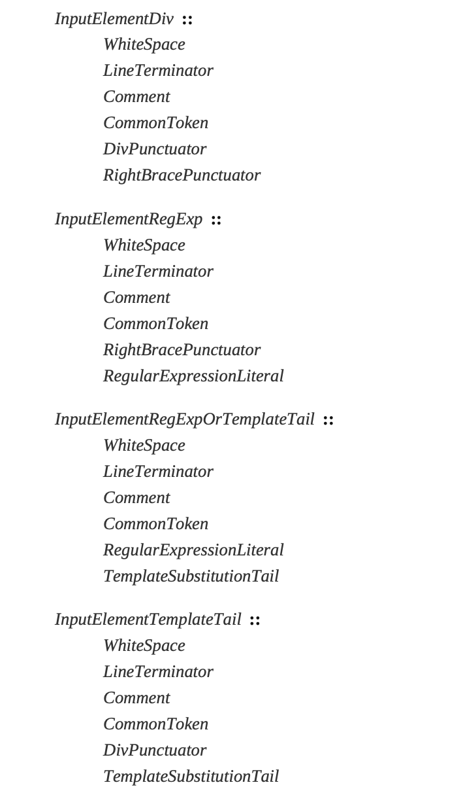

# JavaScript 中的 InputElement

InputElement，直译是输入元素，看着很抽象，我把这个理解为在某个特定语法上下文中可以使用的词法集合。在 Javascript 中有分为四大顶级的 InputElement，分别是如下图：

- InputElementDiv：通用上下文可用词法集合
- InputElementRegExp：正则上下文可用词法集合
- InputElementRegExpOrTemplateTail：正则或者字符串模板可用词法集合
- InputElementTemplateTail：字符串模板可用词法集合

InputElementRegExp 是用于所有允许 RegularExpressionLiteral（正则字面量表达式）但不允许 TemplateMiddle（字符串模板语法） 或 TemplateTail（字符串模板语法） 的语法上下文中。

InputElementRegExpOrTemplateTail 是用于允许 RegularExpressionLiteral、TemplateMiddle 或 TemplateTail 的语法上下文中。

InputElementTemplateTail 是用于所有允许 TemplateMiddle 或 TemplateTail 但不允许 RegularExpressionLiteral 的语法上下文中。

在上述规定以外的语法上下文中，都使用 InputElementDiv 的规范。

这四大 InputElement 其实就是规定了在哪些上下文可以使用哪些字符。为了便于学习，我们可以把这四大 InputElement 中相同的元素合并起来。如下：

> InputElement:
> -- WhiteSpace(空格)
> -- LineTerminator(换行符)
> -- Comment(注释)
> -- Token

我们把`CommonToken`统一归为`Token`，`DivPunctuator`和`RightBracePunctuator`都归为`Token`下面的`Punctuator`类。如下：

> Token:
> -- IdentifierName
> -- Punctuator
> -- NumericLiteral
> -- StringLiteral
> -- Template

Token 英文解释是 indivisible lexical unit，直译就是不可分割的词法单位，也就是组成语句的最小单词。我们先大致了解一下这些分类，后续再针对单个知识点深入学习。
