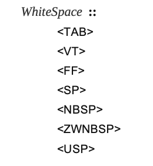
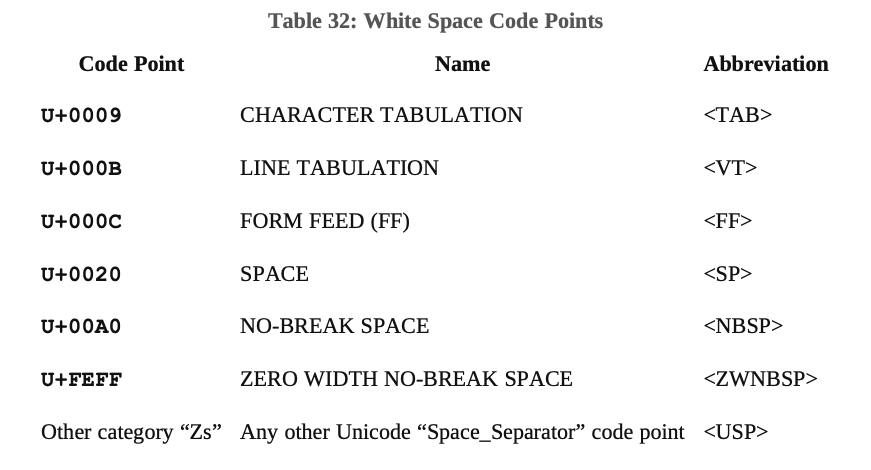
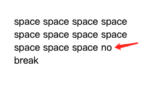
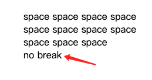
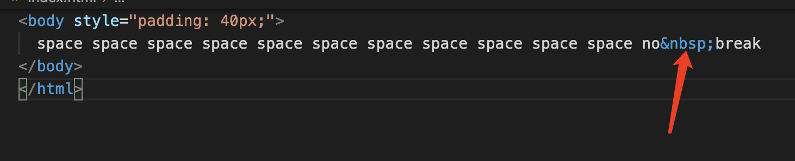

# WhiteSpace

WhiteSpace 就是空格。主要的作用有三个：

- 用于提高源代码的可读性
- 用于分词，也就是区分各个 Token
- 字符串中的空格

除了上述作用，其他的都无关紧要了，可以忽略。空格可以出现在两个 Token 之间，输入的开始和结束之处。空格可以出现在`StringLiteral`、`RegularExpressionLiteral`和`Template`语法中，作为值的一部分。但是不能出现在 Token 中。JavaScript 支持所有属于`Space_Separator`类目的 Unicode 空格符，不在`Space_Separator`中的 WhiteSpace 是不支持的。

WhiteSpace 分为七类：



对应的码点是：



[Unicode White Space 列表](https://www.fileformat.info/info/unicode/category/Zs/list.htm)

下面逐个学习一下 ECMA 文档中重点标注的空格符。

## TAB

英文名：CHARACTER TABULATION，码点：U+0009，转义字符是：\t，中文叫制表符。

下面两个字符间，就是使用了一个 TAB 符分隔的，上下两行会保持在相同的字符数，保持相同的格式。这是与 space 空格的主要区别。

```txt
c1	2
c11	3
```

在行开头，如果在 TAB 前面先输入小于 TAB 长度的 Space，再输入 TAB 符，那么会把单个空格合并成 TAB。例如：TAB 的长度是 4，我们在输入 TAB 前输入 3 个空格，再输入 TAB，就会变成一个 TAB 符。

```txt
 	合并空格
```

通常在我们会使用长度为 2 或 4 的 TAB 来增加源代码可读性。

## VT

垂直制表符，转义字符：\v，我们可以在命令行工具看到效果，如下指令：

```shell
echo VTDemoVTDemo
```


## FF

换页符，转义字符：\f。效果就是把屏幕切换到下一页，如果下一页没有内容，相当于在命令行输入 clear 命令后的效果。

## SP

英文：SPACE，空格，这个就是我们键盘上常用的空格。

## NBSP

应为：NO-BREAK SPACE，中文就是不换行空格。排版效果相对于SPACE。如下图：



上图中，在HTML中换行都是以空格来为基准的，看上图中红色标记部分，如果我们想把`no break`始终都在同一行，这个时候`no`和`break`之间就可以使用NBSP空格来代替SPACE，如下图：

;

;

## ZWNBSP

ZERO WIDTH NO-BREAK SPACE，零宽空格，也叫做字节顺序标记。主要用于帮助系统确定解析的字节顺序。详情学习字节序相关内容。

[字节序](https://zh.wikipedia.org/wiki/%E5%AD%97%E8%8A%82%E5%BA%8F)

[BOM, Byte Order Mark](https://zh.wikipedia.org/zh/%E4%BD%8D%E5%85%83%E7%B5%84%E9%A0%86%E5%BA%8F%E8%A8%98%E8%99%9F)

## USP

除了上述六类空格外的Unicode空白符。

[Unicode White Space 列表](https://www.fileformat.info/info/unicode/category/Zs/list.htm)
