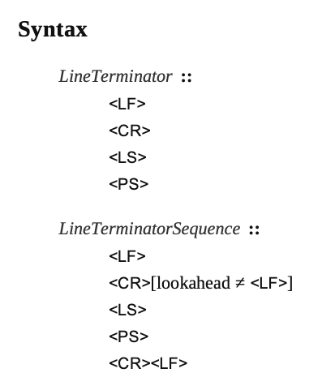
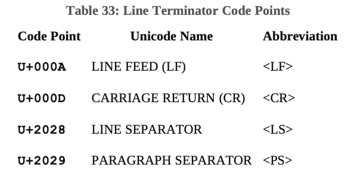
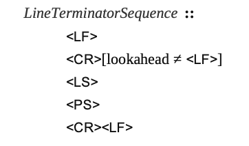

# LineTerminator - 行结束符

这就是我们常用的换行符。它和 WhiteSpace 类似，作用有两个：

- 提高代码可读性
- 用于分词

和空格符不同的是，换行符会影响句法语法的行为。一般来说，换行符可以出现在任意两个 Token 之间，但是在一些语法是不允许出现。换行符也会影响自动插入分号。除了在 StringLiteral, Template, or TemplateSubstitutionTail 中可以出现换行符，在其他 Token 中不能出现换行符。`LF`和`CR`行终止符不能出现在 StringLiteral Token 中，除非作为 LineContinuation 的一部分。

换行符可以出现在多行注释(MultiLineComment)中，但是不能出现在单行注释(SingleLineComment)。

在正则表达式中，我们可以使用`\s`匹配换行符。

换行符分类如下：

换行符码点：

只有上面列举的换行符才是有效的换行符。其他具有换行功能的 Unicode 字符码点都不会解析成换行符(具有行终止功能)，会被解析成 White space。

我们最熟悉的`\n`就是上图中的`<LF>`，换行功能；`\r`就是`<CR>`，回车功能。`\r\n`组合序列是最常见的换行符。`\r\n`会被当作单个源字符。

在换行符语法（Syntax）中，我们看到语法分为两类：

- LineTerminator
- LineTerminatorSequence

LineTerminator 指的是单个换行符规则，LineTerminatorSequence 指的是通过 LineTerminator 中的换行符组合成新的换行符序列的规则。

## LineTerminator

LF 和 CR 前面已经介绍过了，LF 的转义字符是：\n，CR 的转义字符是：\r。

LS 的中文是行分隔符。PS 是段落分隔符。

LS 和 PS 不常用，常用的是 LF 和 CR。

## LineTerminatorSequence

LineTerminatorSequence 是行终止符序列或换行符序列生成规则，规则是由单个 LineTerminator 或者 LineTerminator 之间相互组合形成组合换行符。例如：`\r\n`

所有的组合有：

上图中，`lookahead`的意思是后面紧接着的字符，例如：`<CR>[lookahead ≠ <LF>]`的意思就是`<CR>`后面紧接着的字符不等于`<LF>`的组合。

所以，LineTerminatorSequence 有五个，比 LineTerminator 多出的一个就是`<CR><LF>`，是`<CR>`和`<LF>`组合成的一个换行符序列。
