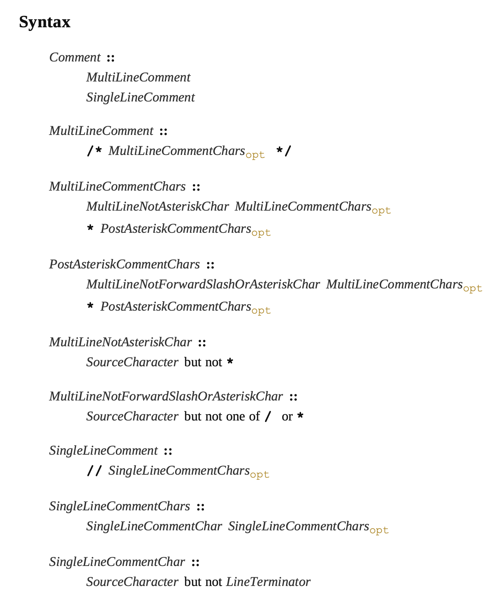

# Comment

注释，有两种，一个单行注释，另外一个是多行注释，**多行注释不能嵌套多行注释**，如下：

```javascript
// 错误用法
/**
  /**
  */
*/
```

单行注释中，不允许出现换行符，编译器在执行词法分析时，会认为 LineTerminator 后的字符不是注释的一部分。把它们当作其他语法来解析。

大部分情况下，注释都不影响源代码，通常也会被丢弃。但是如果在一个多行注释中出现了 LineTerminator，那么这个注释整体会被当作一个 LineTerminator，以便于语法分析。

## 注释语法

先看标准文档的语法结构，如下：



从上往下，最顶层是`Comment`，Comment 由 MultiLineComment(多行注释) 或
SingleLineComment(单行注释)组成。

## 多行注释

多行注释的语法是：由`/*`开头，`*/`结尾，中间部分的内是可选的，由`MultiLineCommentChars`组成。

`MultiLineCommentChars`是由 `MultiLineNotAsteriskChar MultiLineCommentChars` 或 `* PostAsteriskCommentChars`组成。

`MultiLineNotAsteriskChar`是指不包括`*`的注释内容。

`* PostAsteriskCommentChars`是指由`*`开头，后面跟着可选的`PostAsteriskCommentChars`内容。

`PostAsteriskCommentChars`是指由`MultiLineNotForwardSlashOrAsteriskChar MultiLineCommentChars`或`* PostAsteriskCommentChars`组成，

`MultiLineNotForwardSlashOrAsteriskChar`是指不包括`/`和`*`的源字符。

简单的说就是，以`/*`开头，以`*/`结尾，中间可以写任意字符。只不过文档中为了描述多行注释的各种语法，用不同的结构式来描述，这种写法的好处，在于不会遗漏，便于编写测试用例。

## 单行注释

同多行注释的翻译方式.....
