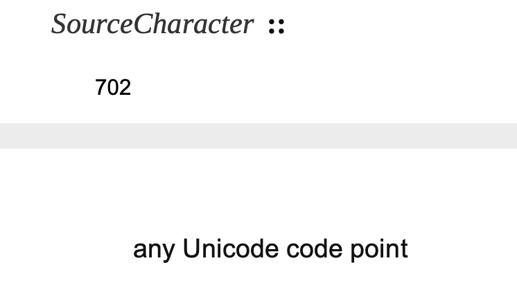

# SourceCharacter - 源字符

简单解释一下什么源字符，源字符就是源代码中的单个字符。如：const，这里就有 5 个源字符，c、o、n、s、t 就是组成 const 的 5 个源字符。

在 ECMA 文档中规定，Javascript 的源字符支持所有 Unicode 字符。



支持`any Unicode code point`；在 JavaScript 中，所有的字符都是以 UTF-16 编码方式来储存，就是用 2 个字节 16bit 来存放一个字符，如果使用的 unicode 字符码点超过了 2 个字节，将会用 4 个字节来存放该字符，而 JavaScript 只会使用 2 字节来计算为一个字符，所以超过 2 字节的字符就会把字符拆解成多个字符。

我们看下标准文档说明：

> ECMAScript code is expressed using Unicode. ECMAScript source text is a sequence of code points. All Unicode code point values from U+0000 to U+10FFFF, including surrogate code points, may occur in source text where permitted by the ECMAScript grammars.

Javascript 支持的 Unicode 范围是 U+0000 到 U+10FFFF，也就是目前 Unicode 所支持的所有字符了。

在 js 中，可以在字符串字面量、正则字面量、字符串模板字面量和标识符中使用 Unicode 码点的转义字符(\u0041)，但是如果在注释中使用 Unicode 转义字符将被忽略，不会被解析成字符。

而且 JavaScript 和 Java 在 Unicode 解析上也存在不同，例如：在 Java 的字符串和单行注释中使用 Unicode 转义字符序列\u000A(换行符)，会被解析成换行操作，也就是该行输入已经终止，接下来的字符将不在属于注释内容或者字符串的内容。在字符串中可以使用`\n`来代替\u000A。但是在 JavaScript 中，不会把 Unicode 转义字符序列\u000A(换行符)解析成行终止符，换行符后的字符还是属于字符串的一部分。

例如：在 AB 中间插入\u000A，会变成如下格式，下面的格式是有语法错误的。

```java
String str = "A\u000A
B";
```

JavaScript 中的表现形式就是如下：

```javascript
const str = "A\u000AB";
```

## UTF-16

UTF-16 有大端字节序（big endian）和小端字节序（little endian）之分，大端字节序是 UTF-16BE，小端字节序是 UTF-16LE。

当然这不是 UTF-16 导致的，这是计算机硬件本身存在的差异。计算机硬件存储数据有两种方式：大端字节序和小端字节序。2 字节以上的数据都会存在字节序的问题，所以单字节的编码方式就不用考虑字节序。

这里举例说明大端字节序和小端字节序的含义：以 0x1583 为例子，高位字节是 0x15，低位字节是 0x83。

- 大端字节序存储就是：0x1583，高位字节在前，低位字节在后
- 小端字节序存储就是：0x8315，高位字节在后，低位字节在前

大端字节序比较符合人类的读写方式。

**为什么有大端字节序和小端字节序之分？**

因为计算机电路在处理二进制时先处理低位字节的效率比较高。所以计算机底层都是使用小端字节序。但是人类的读写习惯就是大端字节序方式，大的在前，小的在后，从左到右来处理的。所以才有大端和小端之分，在计算机底层用小端字节序，在其他场景用大端字节序，例如：网络传输和文件存储。

由于计算机并不知道输入的数据的是大端字节序还是小端字节序，它统一按顺序从低位开始读取字节。所以在读取外部数据时，外部数据需要标识出数据是使用大端还小端方式，然后经过字节序处理器处理成小端字节序，再执行后续的操作。在向外部设备写入数据时，计算机传输的数据是使用小端字节序，要不要处理为大端字节序，由外部设备来决定。

**总结**

UTF-16 有三类：

- UTF-16BE：指定为大端字节序
- UTF-16LE：指定为小端字节序
- UTF-16：不指定具体字节序，在数据最前面增加两字节数据来表示使用的是大端字节序还是小端字节序，这会导致数据体积变大。以 FEFF 开头的是大端字节序，以 FFFE 开头的是小端字节序

- 例如 UTF-16 大端字节序：0xFE FF 4E 45 18 34
- 例如 UTF-16 小端字节序：0xFF FE 18 34

### 编码-Encoding

将 Unicode 码点转换成 UTF-16 码点就叫做 UTF-16 编码。下文我们用 cp 来替换码点

- cp <= 0xFFFF，UTF-16 和 Unicode 的 cp 是一样的，直接返回 Unicode 的 cp
- cp > 0xFFFF 的，需要先计算出高位字节 cu1，再计算出后低位字节 cu2，最后 cu1 和 cu2 组合在一起变成 UTF16 编码

计算高位字节序 cu1：

> 公式：cu1 = floor((cp - 0x10000) / 0x400) + 0xD800

计算低位字节序 cu2：

> 公式：cu2 = ((cp - 0x10000) modulo 0x400) + 0xDC00

举个例子：以 U+1F625（😥）为例，

> cu1 = Math.floor((0x1F625 - 0x10000) / 0x400) + 0xD800 = 0xD83D
> cu2 = ((cp - 0x10000) % 0x400) + 0xDC00 = 0xDE25

所以 U+1F625 的 UTF-16 的大端字节序编码就是 0xFEFF D83D DE25，小端字节序编码是 0xFFFE 3DD8 25DE

[Wiki UTF-16 解析规则](https://zh.wikipedia.org/wiki/UTF-16)

### 解码-Decode

将 UTF-16 码点转换成 Unicode 码点就叫做 UTF-16 解码。解码比编码要简单一些，可以直接使用公式计算。cp <= 0xFFFF 解码还是 cp。公式主要用于 UTF-16 编码大于 0xFFFF 的编码。

解码公式：

> cp = (cu1 - 0xD800) × 0x400 + (cu2 - 0xDC00) + 0x10000

在 ECMA 文档中，解码的 cu1 和 cu2 叫做`lead`和`trail`，可以理解为高位字节和低位字节。
