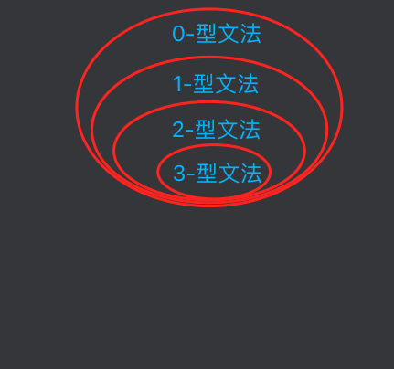

# 乔姆斯基体系

生命不息，学习不止。记录一下了解乔姆斯基体系的过程。

## 定义

引用维基百科中的解释：

> 乔姆斯基体系是计算机科学中刻画**形式文法**表达能力的一个分类谱系，是由语言学家诺姆·乔姆斯基与 1956 年提出的。

看到这句话，简直是让人头痛，一个大大的黑人问号脸表情。计算机科学勉强可以理解就是研究计算机或机器，但是**形式文法**是啥高深的东西呢？没办法，要想了解乔姆斯基体系，只能先查一下**形式文法**是什么，那就看看维基百科里面的解释。

## 形式文法

引用维基百科中的解释：

> 在形式语言理论中，文法(为了避免歧义，常称为“形式文法”)是**形式语言**中字符串的一套产生式规则。这些规则描述了如何用语言的**字母表**生成符合语法的有效的字符串。文法不描述字符串的含义，也不描述在任何上下文中可以用它们做什么————只描述他们的形式。

又有一个没见过的词语：**形式语言**，而且也告诉我们形式文法是存在于形式语言中的。那就先再了解一下**什么是形式语言**吧。

### 形式语言

引用维基百科中的解释：

> 在数学、逻辑和计算机科学中，形式语言是用精确的数学或者机器可处理的公式定义的语言。在形式语言理论中，形式语言是一个字母表上的某些有限长字符串的集合。

具体内容，可点击查看维基百科。[形式语言](https://zh.wikipedia.org/wiki/%E5%BD%A2%E5%BC%8F%E8%AF%AD%E8%A8%80)

在形式语言中，形式文法是形式语言的表示方法之一。表示方法有：枚举法、形式文法、正则表达式和自动机。

**简单来说，就是有固定格式、格式类型有限的语言就可以定义为是一门形式语言。在编程语言中，基本上所有的编程语言都是形式语言，像 C、C++、Java 都是形式语言。**

和形式语言对立的就是非形式语言，例如：中文、英文等。非形式语言就是没有固定格式和形式。以中文为例，当询问别人进餐情况时，可以有问：`你吃饭了吗？`或`吃饭了吗？你`。可能还有很多种表达形式。

## 乔姆斯基体系分类

上面解释了相关的概念，接下来就要了解一下乔姆斯基体系的具体内容了。乔姆斯基体系有四类：

- 0-型文法（无限制文法）
- 1-型文法（上下文相关文法）
- 2-型文法（上下文无关文法）
- 3-型文法（正则文法）

0-型文法包括 1-型文法、2-型文法、3 型文法中的所有的文法。

1-型文法用于生成上下文相关语言。也就是在不同的上下文中，代表的含义不同。比如：字符 a 在英文的上下文是字母 A，在中文的上下文中就是`啊`。1-型文法包含 2-型文法

2-型文法用于生成上下文无关语言。就是不管在什么上下文中，都是一个含义。2-型文法包含 3-型文法

3-型文法用于生成正则语言。我们可以认为用正则表达式实现的语言就是 3-型文法语言。



详情查看维基百科中的[乔姆斯基体系](https://zh.wikipedia.org/wiki/%E4%B9%94%E5%A7%86%E6%96%AF%E5%9F%BA%E8%B0%B1%E7%B3%BB)

在编程语言中，一门语言基本上都是 2-型文法和 1-型文法组成，其中大约 99%是 2-型文法，是上下文无关的，1%是 1-型文法。比如，在 JavaScript 中：

```javascript
const demo = {
  set val(data) {},
  set: 12,
};
```

在`set val() {}`这里的`set`后面接着空格和标识符，就解析成一个`setter`语法。但是在`set: 12`这条语句中，`set`后面是`:`，就解析成普通的属性和属性。

上面讲的乔姆斯基体系都是比较理论的，很晦涩。虽然知道了有哪些文法，但是我们还不知道每种文法对应的语言到底是长什么样子的，有哪些规则。那么接下来，我们先学习一下描述文法规则的表示方法：产生式和巴科斯-诺尔范式(BNF)。

## 产生式和 BNF(巴科斯-诺尔范式)

产生式，在计算机中指 Tiger 编译器将源程序经过词法分析和语法分析后得到的一系列符合文法规则的语句。通俗讲，就是用通俗易懂的字符来表示程序语言的规则。BNF 就是其中的一种产生式。

BNF：

> 是一种形式语言的语法表示方法，用来描述语法的一种形式体系，是一种典型的元语言。

### BNF 语法

这里用例子来说明语法：

```txt
<Number> ::= 0 | 1 | 2 | 3 | 4 | 5 | 6 | 7 | "8" | "9"
```

上例子中，定义了一个 0-9 的整数规则，规则名字就是`<Number>`，`|`表示或的意思，上式的意思就是`<Number>`是代表 0-9 中的任意一个字符。我们把`<规则名称>`这部分称为**非终结符**；把`0`、`1....`或者用双引号(`"字符串"`)括起来的字符串称为终结符。

`::=`可以理解为等号的含义，`::=`的左边称为左项，左项都是非终结符；右边称为右项

- 终结符：是一个形式语言的基本符号，我们可以把它理解为是常量值，字面量。
- 非终结符：终结符理解成字面量，那非终结符就可以理解为程序中的变量，它的值是可以被其他非终结符或终结符替换的。
  [终结符和非终结符的维基百科](https://zh.wikipedia.org/wiki/%E7%B5%82%E7%B5%90%E7%AC%A6%E8%88%87%E9%9D%9E%E7%B5%82%E7%B5%90%E7%AC%A6)

我们再来看一个复杂一点的例子，用 BNF 来表示十进制数字，我们先思考一下十进制有哪些规则：

1. 可以为 0
2. 十位、百位等多个数字组成的数字，不能以`0`开头的数字
3. 1-9 开头，后面跟着无数个 0-9 的数字

根据上面的文字规则，我们用 BNF 来表示，就是：

```txt
<StartNumber> ::= 1 | 2 | 3 | 4 | 5 | 6 | 7 | 8 | 9
<Number> ::= 0 | <StartNumber>
<DecimalNumber> ::= 0 | (<StartNumber> <Number>*)
```

在上例中，`<Number>*`代表`<Number>`中的规则可以出现任意次数，`*`就代表任意次数，可以是 0 次，也可以是很多次，与正则中的`*`含义一样，代表`*`左部分可以出现任意次。

`(<StartNumber> <Number>*)`中，两个非终结符之间有一个空格，这个空格没有什么含义，只是为了书写好看，才加入空格的。这部分的含义就是以`<StartNumber>`中的规则开头，后面跟着任意个`<Number>`，也就是表示的是 1 到无穷(∞)的数字。

在`<DecimalNumber>`中，`|`表示或，也就是说，`<DecimalNumber>`表示就是 0 或者 1 到无穷的数字，也就是十进制数。

假设，我们需要表示 10 到无穷的整数，那要怎么表示呢？很简单：

```txt
<StartNumber> ::= 1 | 2 | 3 | 4 | 5 | 6 | 7 | 8 | 9
<Number> ::= 0 | <StartNumber>
<TenNumber> ::= <StartNumber> <Number>+
```

上例子中，`<Number>+`中的`+`就代表`+`左边部分要至少出现一次，含义和正则中的一样；也就是说由`<StartNumber>`中的规则开头，至少出现一次`<Number>`中的规则，就是表示的是 10 到无穷(∞)的数字。

上面就是所有有关 BNF 的语法。具体详情还可以查看维基百科[Backus-Naur-Form](https://de.wikipedia.org/wiki/Backus-Naur-Form)

### BNF 语法总结
