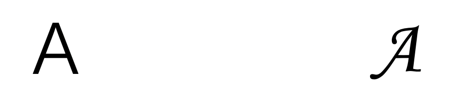
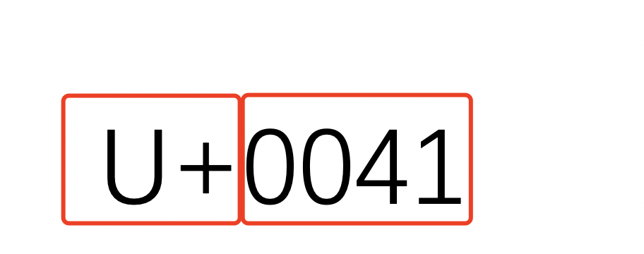
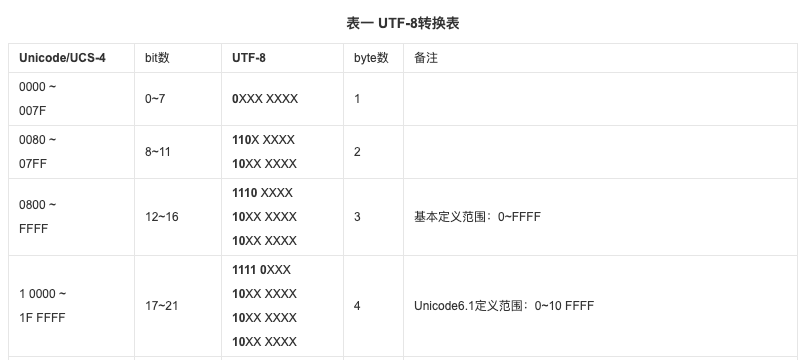

# 字符和字形

在学习编程时，我们最先接触的就是字符，准确的说是 26 个字母。当时我们还不知道一个字母在编程里面就叫字符。下面就来介绍一下这个带我们入坑的字符。

## 字符和字形的关系

字符其实就是符号，包括字母、数据、运算符号、标点符号等符号。那字符和字形有什么关系呢？字形是字符的不同形状、不同的表示方式。比如，“我”这个汉字，它有楷书、隶书、行书、草书等多种字体，但是不管什么样式的字体，表达的内容都一样。

```javascript
// 简体：这
// 繁体：這
```



这就是字符和字形的关系。其实字形就是我们常说的字体。系统或者文字处理软件会根据用户的设定或者默认的设定使用不同的字形来显示一个字符。

我们知道不同的国家是使用不同的文字，为了让计算机能够识别不同的文字，先辈们就把一些常用的字符收集起来，形成一套标准，这就是字符集。字符集就是多个字符的集合。常见的字符集有：

- ASCII 字符集
- GB232 字符集
- BIG5 字符集
- GB18030 字符集
- Unicode 字符集

我们下面主要介绍 ASCII 字符集和 Unicode 字符集，以及编码方法。

## ASCII 是什么

ASCII 是美国信息交换标准，基于拉丁字母创建的一套字符编码系统，主要用于以英语为语言的国家。总共只有 128 个字符，码点(也称为码位)范围：0-127。

什么是码点(code point)呢？我们可以把码点当成字符的身份证号码。在当前字符集中，字符对应的码点是唯一的，不会重复。可以通过码点获取到对应的唯一一个字符。比如，在 ASCII 中，字符 A 的码点就是 65，字符 a 的码点就是 97

ASCII 是一种单字节的字符编码方案，用 8 位二进制数组合来表示字符，最多表示 256 种字符。由于英语没有那么多字符，所以基础的 ACSII 码只使用了 7 位二进制数，也就只有 128 个字符，其中可显示的字符只有 95 个。

像我们使用大写字母、小写字母、数字、运算符号、标点符号等，都是在 ASCII 码中定义的。码点在 65 ～ 90 为 26 个大写英文字母，97 ～ 122 号为 26 个小写英文字母。

ASCII 码简单示例：

| 二进制    | 十进制 | 字符 |
| --------- | ------ | ---- |
| 0100 0001 | 65     | A    |
| 0100 0010 | 66     | B    |
| 0100 0011 | 67     | C    |
| 0100 0100 | 68     | D    |
| 0100 0101 | 69     | E    |
| 0100 0110 | 70     | F    |

[完整 ASCII 字符集](http://www.asciitable.com/)

ASCII 是其他所有字符集的基础，其他的字符集都包含了 ASCII 中的字符。ASCII 在英语中可以表示所有，但是在其他的语言中，128 个字符是完全不够，比如全世界使用人数最多的语言，汉字就有 10 万个字符以上，远远超出了 128。

为了解决 ASCII 表示的字符数量有限的问题，科学家们就在 ASCII 基础上扩展出不同的字符集。Unicode 就是其中之一，也是现如今使用最广泛的字符集。

## Unicode

又称万国码，目标就是使用一种方案包含所有的字符，一个码点对应一个字符。所以只要在支持 Unicode 字符集的计算种，就能显示所有的字符。

Unicode 前 128 个字符和 ASCII 一致，这是为了兼容 ASCII 码。也就是码点 0-127 是属于 ASCII 码的。

### Unicode 码点规则

以字符 A 为例，字符 A 对应的 Unicode 码点是：**U+0041**



上图中，Unicode 码点由两部分组成，`U+`和一组十六进制数组成，也就是说`U+FFFF`也是合法的 Unicode 码点。**一组十六进制数**是指`U+`后面至少有 4 位十六进制数，也有五位或者六位数字的码点，如：`U+00FFF`、`U+10FFFF`。具体是 4 位还是 5 位还是 6 位，要看字符所在的位置的区间(称为平面)

### Unicode 平面

目前 Unicode 的最新版本是 13.0，2020 年 3 月发布的。总共包含 143924 个字符。这么多的字符不是一次性定义好，而是分区定义。这个分区就是我们说的 Unicode 平面。目前 Unicode 共有 17 个平面，每个平面存放 65536(2^16) 个字符。

最常用的的字符的 Unicode 码是由`U+`和四位十六进制数组成（即为 2 字节，一个十六进制数是 4bit，四个十六进制数就是 16bit，8bit 是一个字节，所以 2 字节就可以表示最常用的字符了）。总共 65536 个字符，我们把这些字符存在的分区称为基本平面（简称 BMP），也称零平面、plane 0

基本平面的码点范围是从 0 - 2^16-1，用 Unicode 表示就是 U+0000 到 U+FFFF。除了基本平面外，其他的都称为辅助平面。辅助平面的码点范围是从 U+010000 到 U+10FFFF。

[Unicode 参考文献](https://zh.wikipedia.org/wiki/Unicode)

## 编码方法

在刚了解 Unicode 的时候，经常会有疑惑：Unicode 和 UTF-8 是什么关系呢？

两者的关系类似于字符和字形的关系，都是表示同一个字符，不同的表示方式。那为什么不直接用 Unicode 的方式，为啥还要创建 UTF-8 等方式呢？

Unicode 内部其实产生过两种编码方法，一种是 UCS2，一种是 UCS4。UCS2 是用 2 个字节来编码的，刚开始 2 字节的 65536 个字符是够用，后面科学家们知道的文字越来越多，发现 2 字节不够用了，然后又扩展到 4 字节（因为计算机使用的是二进制，使用 3 个字节的读写效率不高，2 的倍数效率高），所以产生了一种编码方案 UCS4。用 4 个字节基本上涵盖了所有的字符。

但是 UCS2 和 UCS4 都是固定长度的编码方法，也就是说不管什么字符，要么使用 2 字节，要么使用 4 字节来表示。对于现在的网络和存储空间来说，用 2 字节和 4 字节也不是什么大事，但是在那个计算机刚出现的年代，传输速度和硬盘大小都是很珍贵的，如果传输时，不压缩和限制内容，那成本是非常高的。于是就出现了 UTF-8 等编码方法。

UTF-8 不是固定长度的编码方法，最短的 UTF-8 编码只需要 1 个字节，最长是 5 个字节。但是 Unicode 定义的字符最多就是 4 个字节，也就是说 UTF-8 需要 5 个字节，才能完全对应用 4 个连续字节来表示的数量。看上去 UTF—8 还不如 UCS，但是为什么 UTF-8 现在这么出名呢？因为 UTF-8 优化的目标是单字节的字符也就是 ASCII 码中的字符，比如：英文字母。这样每传输一个单字节字符，就可以节约 1 或 3 个字节，是巨大的进步。对于不常用的字符，多几个字节也无所谓。

说了那么多 UTF-8 的来源，下面说说 UTF-8 的编码规则。

### UTF-8

`UTF-8`中的`8`是指 8 个二进制位，就是 8bit，UTF-8 就是至少用 1 个字节来编码。UTF-16 就是至少用 2 个字节来编码，码点在 0-255 中的每个字符比 UTF-8 多 1 个字节。

UTF-8 的编码规则：



我们来看看 Unicode 如何转化到 UTF-8 编码的，对于 U+0000 - U+007F 之间的字符，UTF-8 和 ASCII 码是一一对应的，两者都是相同的。U+0080 之后的字符转化成 UTF-8 就不同了。

以`我`为例，Unicode 码点是 U+6211，对比上图的转换表，6211 是在[0800 - FFFF]之间的，对应 UTF-8 的编码格式就是：`1110 xxxx 10xx xxxx 10xx xxxx`。我们把【我】的 Unicode 码点转成二进制：`0110 0010 0001 0001`，用 Unicode 码点二进制从左到右一次替换 UTF-8 中的`x`，得到`1110 0110 1000 1000 1001 0001`，这就是 UTF-8 的二进制码，我们转成十六进制：0xE68891。

### UTF8 存在的问题

我们在编程的时候经常会用去下标获取某个字符，以【我】为例，在 python 中，

```py
>>> str = '我的‘
>>> str[0]
'\xe6'
```

我们想用下标 0 获取【我】，结果却是一组十六进制数据，我们观察一下这个十六进制数，发现这和【我】的 UTF-8 的十六进制编码的第一个字节是一样的`1110 0110`。所以，如果是汉字，在 UTF-8 中三个字节才能代表一个字符，用下标获取的也是下标对应的字节码。

解决的办法就是先把 UTF-8 转换成 Unicode，然后再使用下标获取字符。

然后，UTF-8在计算字符串长度和查找子字符串上效率很低

## 杂项

据说，Python 3.3 版本之后，内部对 string 做了优化。教程说：Python 内部运行时使用 Unicode 编码方法来表示字符，而在保存到硬盘和在网络上传输，是转成 UTF-8 的。这句话的意思就是 Python3 是使用 UCS 的各种版本来表示字符的。比如说，Python 会先对整个字符串进行一次扫描，如果字符串中的所有字符都是小于 255 的，那么就使用 UCS1，单字节编码方案；如果存在大于 255，但是小于 65535 的字符，就使用 UCS2；如果有超出 65535 的字符，就用 UCS4。

为什么不使用UTF-8？是因为UTF-8在计算字符串长度和查找子字符串上效率很低，使用固定长度的方案（UCS2和UCS4）在计算字符串长度时效率很高，查找子字符串时可以使用高效的搜索算法；但是如果使用UTF-8的话，需要每个字符都计算一次，因为是可变长度的，不知道下一个字符占几个字节，所以需要计算每个字符；

这就是为什么要在保存到硬盘和网络传输时使用UTF-8，保证传输最小化，但是在内部使用时，要保证运行效率，就需要使用效率更高的UCS方案了。

## 思考：Javascript 内部使用的是什么编码

## 参考文章

[ASCII](https://zh.wikipedia.org/wiki/ASCII)
[Unicode](https://zh.wikipedia.org/wiki/Unicode)
[UTF-8](https://zh.wikipedia.org/wiki/UTF-8)
